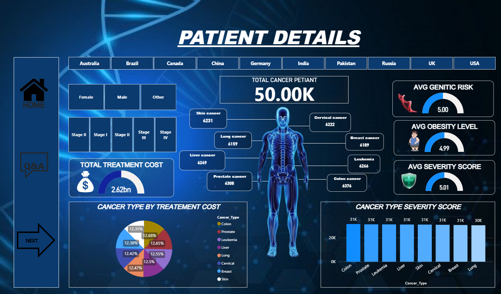
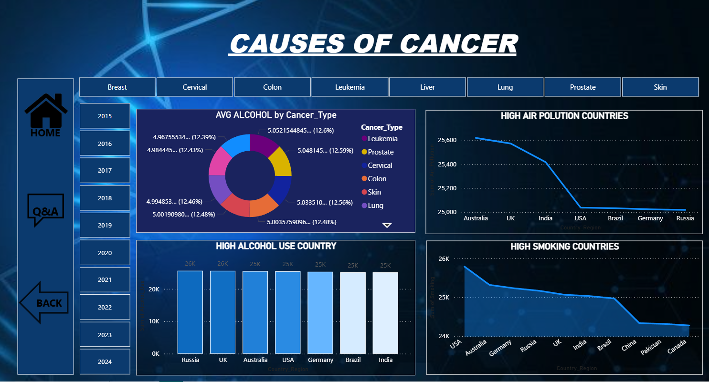

# 🧬 Global Cancer Patient Analytics Dashboard

## Project Overview
This project is a Power BI dashboard built to analyze global cancer patient data.  
It provides insights into patient distribution, causes of cancer, and key healthcare trends.

The goal is to transform raw healthcare data into meaningful insights using data visualization.

---

## 🛠 Tools Used
- Power BI
- Microsoft Excel
- Data Cleaning & Visualization

---

## Dataset
Dataset (`Dataset.xlsx`) includes:
- Patient details
- Cancer types
- Causes of cancer
- Demographic information

---

## Dashboard Pages

### 1. Patient Details Dashboard

### 2. Causes of Cancer Dashboard

---

## Key Insights
- Identified major cancer causes
- Understood patient distribution patterns
- Created interactive healthcare dashboards
- Improved data storytelling skills

---

## Skills Demonstrated
- Data Analysis
- Data Visualization
- Power BI Dashboard Development
- Excel Data Handling
- Analytical Thinking

---

## Project Outcome
This project helped in developing real-world data analytics skills by converting healthcare data into interactive visual insights.

---

## Author
**Aysha Fina**  
Aspiring Data Analyst  
Skills: Power BI | Excel | Data Analysis

